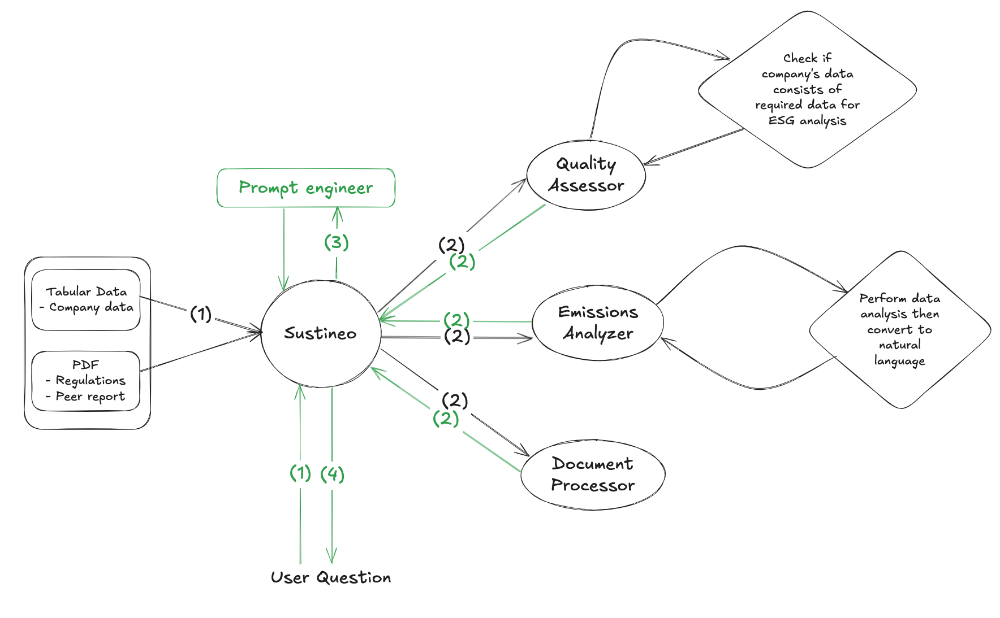
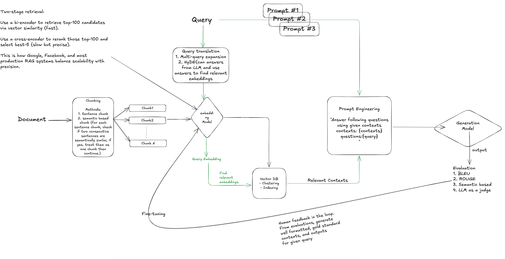

# 🌿 Sustineo

Our Agent Sustineo interacts with its sub-agents(Quality Assessor, Emissions Analyzer, Document processor) to support Q&A, GHG inventory analysis, validate whether it is aligned with regulations, peer benchmarking, and provide insights. RAG, validity checker and prompt engineering are used to ensure provided answers are factual.



Given source data, it first passes it to sub-agents to initialize vector database, extract summary, perform analysis that will become sources used for Q&A, insight generation, validity check, and peer benchmarking. There are three sub-agents:
1. **Quality Assessor**: Assess whether data is correctly formatted and have neccessary data for GHG analysis.
2. **Emissions Analyzer**: Perform data analysis on tabular data then convert to natural language. Analysis include informations such as amount of emissions per facility, energy type, monthly increase in amount of emissions, etc... which are then converted to something like "CompanyA have largest emissions in Office heating ( 4,500COe) and has increased on average 15% per month in the past year".
3. **Document Processor**: Create a vector database.

Once source data were analyzed and converted to saved, our agent is ready to handle any questions.

When client asks a question, depending on the question it fills specialized prompts with appropriate data before going straight to answers. This ensures agent only provides most accurate informations.

Example:
```bash

<User>
Should employee business travel be classified as Scope 1 or Scope 3, explain the reasoning and describe how I can calculate my business travel emissions.

<Sustineo>
Based on the GHG Protocol guidelines and the provided emissions data, employee business travel should be classified as **Scope 3**.

Reasoning for Classification:
1.  GHG Protocol Definition of Scope 3: The GHG Protocol defines Scope 3 emissions as "a consequence of the activities of the company, but occur from sources not owned or controlled by the company." (Context 3).
2.  Ownership and Control: The key determinant for classifying emissions as Scope 1 or Scope 3 is whether the emission sources are "owned or controlled by the company." (Context 1).
    * Scope 1 emissions are direct emissions from sources owned or controlled by the company (e.g., company-owned vehicles, stationary combustion at company facilities).
    * Scope 3 emissions are indirect emissions that occur in the value chain of the reporting company, but from sources not owned or controlled by the company.
3.  Employee Business Travel: When employees travel for business, they typically use commercial airlines, rental cars, taxis, or their personal vehicles. In these scenarios, the company does not own or directly...
```


## Sub-agent: Document Processor


RAG system that robustly handles PDFs no matter whether data is scanned or text-based. It processes tabular data and pdfs then perform appropriate chunking before embedding. Each source generates separate vector database for faster lookup and reference. Additionally, each chunk has metadata containing its source and location from the source text so that users can double check for hallucinations. 


## 🎯 Features

- **📊 Emissions analysis**: Scope 1, 2, and 3 with summaries and totals
- **💬 Natural language Q&A**: Answers grounded in the GHG Protocol and your data
- **✅ Quality assessment**: Scope 2 validity checks against GHG Protocol guidance
- **📈 Peer benchmarking**: Summarize peer reports and compare against your data
- **🎯 Supplier prioritization**: Identify high-impact suppliers for engagement
- **🖹 OCR for scanned PDFs**: Tesseract-based OCR for image-only pages
- **📝 Automated reporting**: Generate structured summary reports

## 🚀 Quick start

### Requirements

- Python 3.12+
- GOOGLE_API_KEY(Must download service acount key and set it to environment variable first.)
- Tesseract for OCR

### Install

```bash
# Clone the repository
git clone https://github.com/yourusername/Sustineo.git
cd Sustineo

# Create and activate a virtual environment
python -m venv .venv
source .venv/bin/activate  # On Windows: .venv\Scripts\activate

# Install Python dependencies
pip install -r requirements.txt
```

### Install Tesseract OCR (required for scanned PDFs)

- macOS (Homebrew):
```bash
brew install tesseract
```

- Ubuntu/Debian:
```bash
sudo apt-get update && sudo apt-get install -y tesseract-ocr
```

- Windows:
Download the installer from the [Tesseract OCR releases (UB Mannheim build)](https://github.com/UB-Mannheim/tesseract/wiki) and ensure the installation directory (e.g., `C:\Program Files\Tesseract-OCR`) is on your PATH.

If Tesseract is installed in a non-standard path, you can point `pytesseract` to it:

```python
import pytesseract
pytesseract.pytesseract.tesseract_cmd = "/path/to/tesseract"
```


## 📁 Project structure

```
sustineo/
├── README.md
├── requirements.txt
├── demo.py
├── data/
│   ├── raw/
│   │   ├── ghg-protocol-revised.pdf
│   │   ├── peer1_emissions_report.pdf
│   │   ├── peer2_emissions_report.pdf
│   │   ├── scope1.csv
│   │   ├── scope2.csv
│   │   └── scope3.csv
│   └── processed/
│       ├── peer1_text.txt
│       └── peer2_text.txt
├── demo_outputs/
│   └── answer*.txt
└── src/
    ├── agent.py
    ├── data_loader.py
    ├── document_processor.py
    ├── emissions_analyzer.py
    ├── quality_assessor.py
    └── utils.py
```

## Upcoming features:
- Better OCR: extract table from image, graph support.
- Super fast lookup with ScaNN for scalable architecture: [Accelerating large scale inference with anisotropic vector quantization](https://medium.com/@haneulkim/paper-review-accelerating-large-scale-inference-with-anisotropic-vector-quantization-part-ii-167c219ac902)